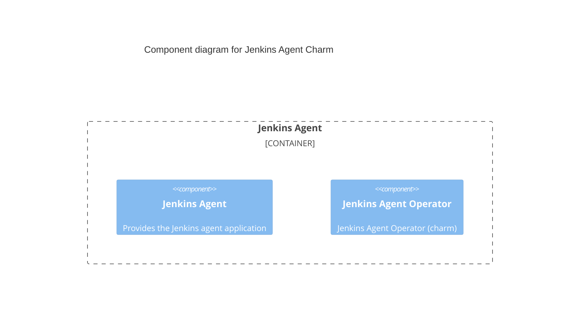

# Charm architecture

The Jenkins agent charm aims to provide Jenkins agents on top of virtual machines (VMs). The charm is designed to be flexible, allowing for easy configuration and management of Jenkins agents.

## Services

The core component of the Jenkins agent charm consists of a Jenkins agent main workload. The services inside the VM is driven by the charm itself.

### Jenkins Agent

The Jenkins agent is started via the systemd `jenkins_agent` service, installed by the charm.
Upon receiving the `JENKINS_TOKEN`, `JENKINS_URL`, `JENKINS_AGENT` environment variables from the configuration, it starts the agent with these parameters. The agent will then connect to the Jenkins controller using these parameters.

### charm

This container is the main point of contact with the Juju controller. It communicates with Juju to
run necessary charm code defined by the main `src/charm.py`. The source code is copied to the
`/var/lib/juju/agents/unit-UNIT_NAME/charm` directory.

## Integrations

See [Relation endpoints](../reference/integrations.md).

## Juju events

Juju events allow progression of the charm in its lifecycle and encapsulates part of the execution
context of a charm. Below is the list of observed events for `jenkins-agent charm` with how the charm
reacts to the event. For more information about the charm’s lifecycle in general, refer to the
charm’s life [documentation](https://canonical-juju.readthedocs-hosted.com/en/3.6/user/reference/hook/).

### install

This event triggers the installation of the Jenkins agent service. It also installs the required dependency `openjdk-21-jre`.

### start

This event marks the charm’s state as started. See the documentation on the
[start event](https://canonical-juju.readthedocs-hosted.com/en/3.6/user/reference/hook/#start).

### config-changed

The jenkins-agent charm reacts to any configuration change and runs reconciliation between the current
state and the desired state. See the list of
[configurations](https://charmhub.io/jenkins-agent/configure).

### agent-relation-{joined,changed,departed}

The jenkins-agent charm receives updates about the main Jenkins controller through the agent relation events. The Jenkins agent service is started or terminated accordingly.

### upgrade-charm

The `upgrade-charm` event is fired on the upgrade charm command `juju refresh jenkins-agent`. The command restarts the Jenkins agent service.

## Charm code overview

The `src/charm.py` is the default entry point for a charm and has the JenkinsAgentCharm Python class which inherits from CharmBase.

CharmBase is the base class from which all Charms are formed, defined by [Ops](https://juju.is/docs/sdk/ops) (Python framework for developing charms).

> See more in the Juju docs: [Charm](https://canonical-juju.readthedocs-hosted.com/en/3.6/user/reference/charm/).

The `__init__` method guarantees that the charm observes all events relevant to its operation and handles them.

